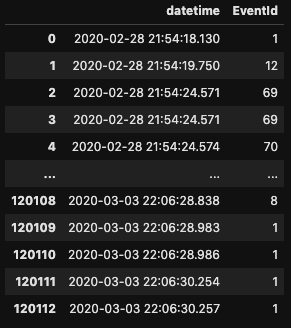
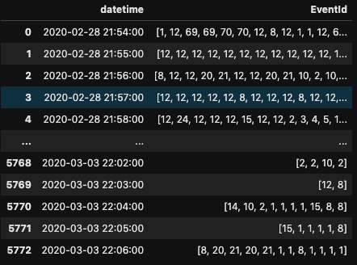

# Data Engineer Exam

## 1. Anomaly Detecton

You have 67 time series data in `data/anomaly_detection/time-series.zip`, add a column called `anomaly`.

Fill `1` if the point is anomaly else `0`, you can use *ANY* methods to detect anomalies.

(NOTE: The time series data may not contain anomaly.)

## 2. Pandas

Use [Pandas](https://pandas.pydata.org/) to transform data `data/pandas/train_need_aggregate.csv` and `data/pandas/test_need_aggregate.csv` from [Figure 1](#figure-1) to [Figure 2](#figure-2).

### Figure 1

### Figure 2

## 3. Deep Learning

1. Use deep learning framework **PyTorch** to build an LSTM Model.

2. Use the model you built in step 1, use the train file you aggregated in question [**Pandas**](#2-pandas) to train a model. Save the model weight somewhere.

3. Load the model weight to predict the test file you aggregated in question [**Pandas**](#2-pandas).

   3.1. Point out which time point is an anomaly. Add a column called `anomaly`, fill `1` if the point is anomaly else `0`.
